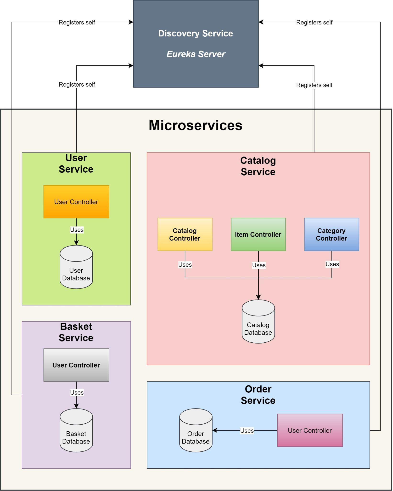

# Microservices eSHOP
## Introduction
This project is a Java SpringBoot microservice application for a simple e-shop backend. This project utilizes some basic Docker operations and was part of a term project during Software Architectures [course](https://moodle.fel.cvut.cz/local/kos/pages/course/info.php?id=5866&semester=curr&lang=en) at [CTU FEE](https://fel.cvut.cz). Due to team based nature of the project, my repository contains only the microservices I have personally worked on. Missing Order and Catalog microservices are similar in structure.

### Used technologies
- Java 11 with SpringBoot for base source
- Docker for running app in separate containers
- Eureka for service discovery
- Swagger OpenAPI for API endpoints documentation endpoints
- JUnit and Mockito for testing the REST API

### Microservices
1. User service
2. Basket service
3. Order service *(not my work, not present in repo)*
4. Catalog service *(not my work, not present in repo)*
5. Discovery service

### Docker
Each microservice had its own GitLab repository that used CI pipeline to push a docker image built from source to GitLab registry. The `docker-and-ci` root directory contains scripts we used to pull all images from the registry and then run the application in Docker as multiple containers.

### Tests
Each core microservice is tested with basic CRUD mock tests to verify REST API communication.

## Documentation

The repository also contains a PDF with a simple documentation within `docs` directory.

### Architecture

